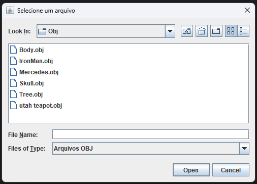
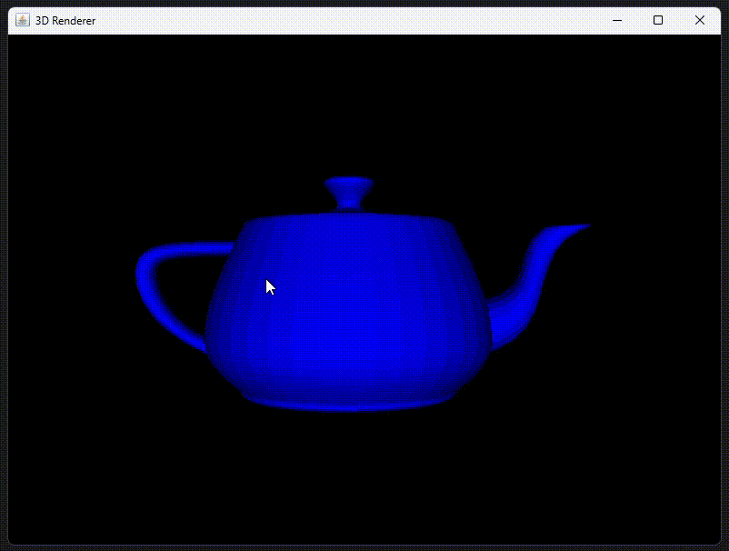
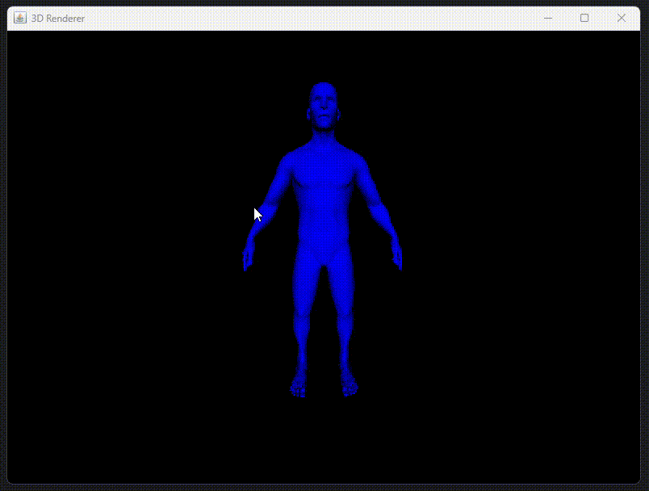

# Java 3D Renderer

  

Um projeto experimental desenvolvido para estudar e compreender os conceitos fundamentais de renderização 3D utilizando Java.  
O objetivo é construir, do zero, um renderizador simples capaz de carregar modelos, manipulá-los no espaço 3D e aplicar transformações e iluminação básicas.  

Objetivos do Projeto:  
[X] - Carregamento de arquivos .obj  
[X] - Rotação de câmera  
[X] - Zoom no objeto  
[X] - Iluminação básica para percepção de profundidade  

## Demonstração

Seletor de arquivos:  

Modelo de Bule de Utah  

Modelo de um corpo humano  

